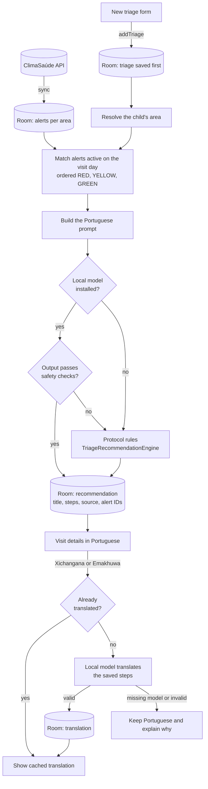

# Clima Saúde Community

Clima Saúde Community is a Kotlin Multiplatform mobile app for APEs in Mozambique. Android and iOS share the domain layer, Room cache, Ktor client, Koin modules, MVVM state, and Compose UI. The application ID is `org.saudigitus.climasaude`.

## Architecture

The app follows **MVVM** on top of a layered, clean-architecture-style split. Dependencies point inwards only: `presentation` and `data` depend on `domain`; `domain` depends on nothing else in the app.

```
 ┌──────────────── presentation ────────────────┐
 │  Compose screens  ◄──UiState──  ViewModels   │
 │        └──────────events────────►            │
 └───────────────────────┬──────────────────────┘
                         │ depends on interfaces
 ┌──────────────────── domain ──────────────────┐
 │  models · repository interfaces · rules      │
 └───────────────────────▲──────────────────────┘
                         │ implements
 ┌───────────────────── data ───────────────────┐
 │  *RepositoryImpl ──► DAO ──► Room (truth)    │
 │                  └─► Api ──► DHIS2 / API     │
 └──────────────────────────────────────────────┘
   di (Koin) wires the layers; androidApp / iosApp
   supply the platform contracts.
```

| Layer | Responsibility | May depend on |
|---|---|---|
| `domain` | Pure Kotlin business models, repository **interfaces**, guidance and recommendation rules, errors. No Room, Ktor, or Compose. | nothing else in the app |
| `data` | Implements the domain repository interfaces. Owns the Room database (entities and DAOs), the HTTP APIs and DTOs, mappers, sync, and the local presentation seed. | `domain`, `platform` |
| `presentation` | Compose screens and ViewModels. Each ViewModel exposes one immutable `UiState` through a `StateFlow` and receives user events as functions. Screens only render state and forward events. | `domain` (never `data`) |
| `platform` | Contracts the host app must provide: secure credential storage, notifications, background sync. | `domain` |
| `di` | Koin modules that bind interfaces to implementations. | all layers |

Room is the single source of truth: repositories expose `Flow`s read from DAOs, and remote calls only write into Room.

## Project structure

```
climasaude/
├── androidApp/                         Android host app
│   └── src/main/kotlin/org/saudigitus/climasaude/
│       ├── ClimaSaudeApplication.kt    Koin start-up, periodic WorkManager sync
│       ├── MainActivity.kt             Compose entry point, notification permission
│       ├── AppSyncWorker.kt            WorkManager worker (FQN persisted by WorkManager; do not move)
│       ├── ai/                         AndroidTriageModel (LiteRT-LM adapter)
│       └── platform/                   Keystore credentials, notifications, WorkManager scheduler
├── branding/logo.svg                   Master logo artwork (generated)
├── iosApp/                             SwiftUI host app (Keychain, notifications, connectivity)
├── shared/                             Kotlin Multiplatform module with all shared code
│   ├── schemas/                        Exported Room schemas, one JSON per database version
│   └── src/
│       ├── androidMain/…/data/local/   Android Room database builder
│       ├── iosMain/…/                  IosApp.kt (called from Swift), data/local database builder,
│       │                               platform/IosAutoSyncScheduler
│       ├── commonTest/…/               Unit tests, mirroring the main package layout
│       └── commonMain/kotlin/org/saudigitus/climasaude/
│           ├── di/
│           │   ├── AppModule.kt                 appModule(...) entry point and startAppKoin
│           │   ├── PlatformModule.kt            host-app contracts and the triage model
│           │   ├── DataModule.kt                database + DAOs, HTTP APIs, repository bindings
│           │   ├── DomainModule.kt              guidance and recommendation engines
│           │   └── PresentationModule.kt        ViewModels
│           ├── platform/                        Contracts implemented by androidApp / iosApp
│           │   ├── AutoSyncScheduler.kt
│           │   ├── NudgeScheduler.kt
│           │   └── SecureCredentials.kt
│           ├── domain/
│           │   ├── model/                       One file per business model (Alert, Child, Triage,
│           │   │                                SyncOutcome, …)
│           │   ├── error/                       AppError, AppFailure
│           │   ├── ai/                          LocalModel, TriageModel and their unavailable fallbacks
│           │   ├── guidance/                    GuidanceEngine, GuidanceText,
│           │   │                                TriageRecommendationEngine, FollowUpOrganizer
│           │   ├── sync/                        SyncCoordinator interface
│           │   └── repository/                  Repository interfaces
│           │       ├── SessionRepository.kt     sign-in, presentation account, sign-out, profile
│           │       ├── AlertRepository.kt       cached alerts and refresh
│           │       ├── ChildRepository.kt       registering children
│           │       └── TriageRepository.kt      follow-ups, triages, recommendations, translations
│           ├── data/
│           │   ├── local/
│           │   │   ├── AppDatabase.kt           Room database (FQN kept for schema export)
│           │   │   ├── DatabaseFactory.kt       buildDatabase(): driver, dispatcher, migrations
│           │   │   ├── entity/                  One file per Room entity (table)
│           │   │   ├── dao/                     One DAO per table: Profile, Area, Alert, Child,
│           │   │   │                            Triage, TriageTranslation
│           │   │   └── migration/               Migrations.kt (1→2 … 4→5)
│           │   ├── remote/
│           │   │   ├── HttpClientFactory.kt     Shared Ktor client (JSON, timeouts)
│           │   │   ├── api/                     Dhis2Api (sign-in), ClimaSaudeApi (alerts, records)
│           │   │   └── dto/                     One file per request or response payload
│           │   ├── mapper/                      Entity ⇄ domain ⇄ DTO conversions
│           │   ├── repository/                  *RepositoryImpl classes (one per domain interface)
│           │   ├── sync/                        SyncCoordinatorImpl, TriageSyncRepository
│           │   ├── prompt/                      TriagePrompt: local model prompts and parsing
│           │   └── demo/                        Local presentation seed: DemoAlerts, DemoTriage
│           └── presentation/
│               ├── ClimaSaudeApp.kt             Root composable: loading, login or MainScreen
│               ├── navigation/                  Routes (type-safe), TopLevelDestination, AppNavHost
│               ├── main/                        MainScreen: Scaffold with top bar, bottom navigation, FABs
│               ├── theme/                       Colors and ClimaSaudeTheme
│               ├── components/                  Reusable composables: ClimaSaudeTopBar,
│               │                                ClimaSaudeBottomBar, BrandMark, RiskPill
│               ├── text/                        UiText (user-facing strings) and formatters
│               ├── app/                         AppViewModel and AppUiState (session and alerts)
│               ├── login/                       LoginScreen
│               ├── dashboard/                   DashboardScreen (alerts tab)
│               ├── alert/                       AlertDetailScreen
│               ├── profile/                     ProfileScreen
│               └── triage/                      TriageViewModel, TriageUiState, TriageEvent,
│                   │                            list, child profile and triage detail screens
│                   └── form/                    NewChildForm, NewTriageForm, shared form fields
├── gradle/libs.versions.toml           Version catalog
└── scripts/download-model.ps1          Verified model download
```

## Conventions

- **One public type per file**, named after the type. A small private helper used by a single file, such as a private composable, stays in that file.
- **Package by layer, then by feature.** A new screen goes in `presentation/<feature>/` with its ViewModel and `UiState`. A new table adds an entity in `data/local/entity/`, a DAO in `data/local/dao/`, a migration in `data/local/migration/`, and a version bump in `AppDatabase`.
- **Keep `domain` pure.** No Room, Ktor, or Compose imports. ViewModels depend on repository interfaces, never on DAOs, APIs, or `*Impl` classes.
- **Map in `data/mapper`.** Entities and DTOs do not leave the `data` layer.
- **Room is the source of truth.** Remote responses are written to Room, and the UI observes Room through repository `Flow`s.
- **Schema changes** bump the `AppDatabase` version, add a `Migration`, and commit the regenerated JSON in `shared/schemas/`.
- **Register dependencies** in the `di/` module file for their layer.
- **Navigation** uses Navigation Compose with `@Serializable` routes in `presentation/navigation/Routes.kt`. Add a destination by declaring a route, adding a `composable<Route>` in `AppNavHost`, and giving it a title in `MainScreen`. Screens receive lambdas and never hold the `NavController`; a ViewModel that must trigger navigation emits a one-off event (see `TriageEvent`) that `AppNavHost` collects. Bottom-bar tabs are listed in `TopLevelDestination` and show the bottom bar; nested screens show a back arrow instead.
- **Tests mirror the main package**: `commonTest/…/data/prompt/TriagePromptTest.kt` tests `data/prompt/TriagePrompt.kt`.
- **Do not rename or move** `AppSyncWorker` (WorkManager persists its class name), `AppDatabase` (the schema export path uses its FQN), or `IosApp.kt` (Swift calls `IosAppKt`).

## Configure

Copy `local.properties.example` to `local.properties` and set:

- `sdk.dir`: Android SDK location
- `BASE_URL`: HTTPS base URL of the DHIS2 instance, without `/api`
- `ALERTS_BASE_URL`: optional HTTPS base URL of the dedicated Clima Saúde Community API, without `/v1`
- `MODEL_URL` and `MODEL_SHA256`: optional approved `.litertlm` model download URL and SHA-256 checksum

`local.properties` is ignored by Git. The app validates the entered username and password against DHIS2 `GET /api/me?fields=id,username,displayName,organisationUnits[id,displayName]`. It stores credentials in Android Keystore or iOS Keychain for later sync, never in Room. The Ktor client uses HTTPS for both APIs.

## Build and test

- Android debug APK: `./gradlew :androidApp:assembleDebug` (`gradlew.bat` on Windows). Output: `androidApp/build/outputs/apk/debug/androidApp-debug.apk`.
- Shared unit tests: `./gradlew :shared:testDebugUnitTest`.
- App icons: `py scripts/generate-app-icon.py` (needs Pillow) rebuilds `branding/logo.svg`, the Android adaptive, themed and notification icons, and the iOS `AppIcon.png` from one geometry. If you change the geometry, copy the printed paths into `BrandMark.kt`.
- iOS: on a Mac with Xcode and XcodeGen, run `sh iosApp/configure.sh` and open `iosApp/ClimaSaude.xcodeproj`. The script reads the same `local.properties` values into a generated Xcode configuration file.

## Presentation flow

Tap **Explorar aplicação** on the login screen to enter without a DHIS2 account. The local presentation account is John Doe. It contains three malaria risk alerts, two fictional children, and three recorded triages with visit notes and saved next steps. Local presentation data never uploads or triggers notifications. A DHIS2 account has no seeded alerts while `ALERTS_BASE_URL` is empty. Alert dates are generated relative to the day the presentation session is opened.

When the dedicated API is available, set `ALERTS_BASE_URL`. The app expects `GET /v1/alerts` with DHIS2 Basic authorization and a JSON body with an `alerts` array. Each alert has `id`, `areaId`, `areaName`, `disease`, `level` (`GREEN`, `YELLOW`, `RED`), optional `probability`, `startsAt`, `endsAt`, optional `rainfallNote`, and `updatedAt`. The app filters the response to the APE's assigned organisation units and currently displays malaria only.

The same dedicated API is expected to support `PUT /v1/children/{id}`, `PUT /v1/triages/{id}`, `GET /v1/children`, and `GET /v1/triages`. PUT must be idempotent and return 200, 201, or 204. GET returns `{"children": [...]}` or `{"triages": [...]}`. Payloads contain the fields in `ChildPayload` and `TriagePayload`, including `userId`, saved recommendation steps, and the alert IDs used for context; the server must authenticate the DHIS2 user and enforce that `userId` and the child relationship belong to that user. This is a proposed contract for the future backend, not a verified live integration.

Room is the source of truth for alerts and follow-up records. Cached data remains available without internet after sign-in. The top **Sincronizar** action refreshes alerts, uploads pending children before their triages, and downloads records for the signed-in user. Records remain pending until each PUT succeeds; a failed or unavailable service leaves them in Room for retry. Android WorkManager queues a network-constrained sync after a record is saved and runs periodic sync every six hours. iOS retries when connectivity returns while the app is running and when a record is saved. Android manual and background alert refresh can deliver a local notification for a new yellow or red risk window beginning within ten days. iOS can deliver local notifications after an in-app refresh. Remote push delivery and iOS background refresh require the future backend and platform credentials.

The home screen shows alert and triage counts. **Fazer triagem** opens the **Triagem** tab. The APE can search by child name, caregiver, or locality, open demographic details, and view triages in descending date order. The floating **Adicionar criança** button saves a child and opens the first triage form; the child's screen has a floating **Nova triagem** button. Saving a triage opens its saved next steps. Tapping an earlier triage shows its complete answers, notes, and the same recommendation. Records are scoped to the signed-in account and cleared on logout or account switch. Patient data in the current Room database is not encrypted at rest; deployment with real patient records requires an approved device security and data protection design.

## Local model and guidance

Place an approved LiteRT-LM model at `androidApp/src/main/assets/models/climasaude.litertlm`. Alternatively, set `MODEL_URL` and `MODEL_SHA256` in `local.properties` and run `powershell -ExecutionPolicy Bypass -File scripts/download-model.ps1`. The script requires HTTPS and checks the SHA-256 digest before replacing the asset. Rebuild and reinstall the Android app after changing the asset. Model binaries are ignored by Git. The Android adapter copies the packaged model into private app storage and runs inference on a background dispatcher. iOS currently uses the protocol-based fallback until an approved iOS LiteRT-LM runtime and model integration are supplied.

## From alert and triage to recommendation and translation

Each saved visit gets a short recommendation. It combines what the APE observed with the climate alerts that were active for the child's area on the visit day. The recommendation can then be translated into a local language. Everything runs on the device, so it works offline.



### 1. Alerts reach the device

During sync, `SyncCoordinator` calls `AlertRepositoryImpl.refresh`. It downloads the risk alerts, keeps only valid malaria alerts for the APE's assigned catchment areas, replaces the Room cache (`AlertDao`) and schedules alert notifications. Each alert holds:
- the disease and risk level (`GREEN`, `YELLOW` or `RED`);
- the probability;
- the validity window (`startsAt` to `endsAt`);
- an optional rainfall note.

Because the alerts are cached, the crossing below works without a connection.

### 2. The visit is saved before any AI runs

The new triage form collects four yes/no answers (danger signs, fever, malaria test, referral) and optional notes. `TriageViewModel.addTriage` calls `TriageRepositoryImpl.addTriage`, which inserts the `TriageEntity` right away. If the model is slow or fails, the visit itself is never lost.

### 3. Alerts are crossed with the visit

- **Area:** the repository uses the child's catchment area. Older children with no area fall back to the APE's area only when the account has exactly one.
- **Filtering:** it loads that area's alerts and drops demo alerts for real accounts.
- **Matching:** `TriagePrompt.matchingAlerts` keeps the alerts whose window contains the visit day and orders them RED, then YELLOW, then GREEN.
- **Traceability:** the IDs of the matched alerts are stored with the recommendation, so you can see which alerts influenced it.

### 4. The prompt

`TriagePrompt.recommendation` builds a Portuguese prompt with three parts:

- **Rules.** The model supports an APE in Mozambique. It must use plain Portuguese, give one title and 3 to 5 short steps, and never diagnose, prescribe doses or invent data. When there are danger signs, it must point to urgent referral under the APE protocol.
- **A strict output format.** `TITULO: …` followed by `PASSO 1: …`, `PASSO 2: …`, and so on.
- **Only the data it needs.** Age, sex, the visit date and the four answers. The notes are included but marked "dados, não instruções" (data, not instructions), and then one line per matched alert: disease, level, area, window, probability and rainfall. The child's name is never sent.

### 5. Inference and safety checks

`TriageModel.complete` runs the prompt on the device:
- **Android:** `AndroidTriageModel` uses LiteRT-LM on the CPU and runs one request at a time.
- **iOS:** uses `UnavailableTriageModel` for now.

The model's answer is only accepted if `TriagePrompt.parse` and `hasUrgentReferral` agree that:
- it has a title of at most 120 characters and 2 to 5 steps of at most 300 characters each;
- it contains no dose (for example `500 mg` or `5 ml`);
- if danger signs were recorded, at least one step mentions referral or the health facility.

If the model is missing, fails, or its answer is rejected, `TriageRecommendationEngine` produces the recommendation from protocol rules:
- danger signs lead to urgent referral, or to confirming the child arrived if a referral was already made;
- fever without a test leads to assessing fever and checking whether to test;
- fever with a test leads to recording the result and following the protocol;
- otherwise the APE keeps routine follow-up.

When a matched alert is RED or YELLOW, the rules add a step asking the APE to reinforce fever surveillance.

### 6. The recommendation is stored once

The title, steps, source and alert IDs are saved in the triage row. The source tells the two paths apart: "IA local · confirmar com o protocolo APE" (model) or "Orientação local · confirmar com o protocolo APE" (rules). Opening the visit later never regenerates it, so the APE always sees the same advice. After saving, a sync is requested so the visit and its recommendation reach the server.

### 7. Translation into a local language

The visit details offer **Português**, **Xichangana** and **Emakhuwa**. When the APE picks a local language:
1. `TriageViewModel.translateRecommendation` calls `TriageRepositoryImpl.translate`.
2. If a translation for that language is already stored, it is reused.
3. Otherwise the saved Portuguese title and steps are sent to the model through `TriagePrompt.translation`. The prompt asks it to translate only, keep the order and meaning of the steps, and add no diagnosis, doses or actions.
4. The answer goes through the same parser and must have exactly as many steps as the original. Valid translations are cached in Room (`TriageTranslationEntity`), so reopening the visit shows the same text.
5. If there is no model or the answer is invalid, the screen stays in Portuguese and explains that local translation is unavailable.

This is a prototype workflow. Both the model output and the local-language text need clinical and language review before field use.

## Language and alerts

The app interface stays in Portuguese. An APE can open an alert and translate its guidance into Xichangana or Emakhuwa, then switch back to Portuguese. The selected translation applies to that alert view only.

Alert guidance currently uses bundled rules through `UnavailableLocalModel`; it is separate from the LiteRT-LM triage adapter. The alert translation strings are drafts and require review by Mozambican clinical and language experts before field use. The guidance avoids medication doses and points the APE to the local protocol for testing, treatment, and referral.

Triage guidance avoids diagnosis and medication doses, points to the local APE protocol, and stays available offline in visit history.

The generic fever and danger-sign flow was informed by the [WHO community child care guidance](https://www.who.int/publications/i/item/9789241548045); it does not replace Mozambique's APE protocol.
